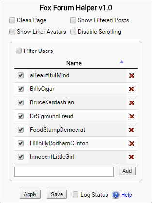

The [Fox Forum Helper](https://github.com/holly4/FoxForumExtension) is a Chrome extension that adds customization to the Fox News Forums. 

 "Extension User Interface")

## Background

To better understand why the Extension works the way it does it's important to understand there are two parts of the extension.

1. The **User Interface** which is seen when the icon for the extension is clicked in the Chrome Extensions bar.
2. The **Service Worker** which runs inside the Fox News Forum web page in your browser.

The **User Interface** is used to select features of the extension and only when the **Apply** button is checked are the state of these features communicated to the extension.

The **Save** button is used to store the state of the features in the U/I to be used when the Extension is opened on a different Fox News Forum web page. If you refresh the current Fox News page in the browser this has the same effect as navigating to another page, i.e., the **Apply** button needs to be pressed again to re-enable the selected features. To better summarize, the Service Worker is only working inside the current instance of the Fox News Forum Web Page.

## Important Note \#1

In the present version of the extension, no changes are automatically made when the Fox News Forum web page is navigated to. It is likely that a future version of the extension will automatically effect this, but to again emphasize, no changes are made to a newly loaded page whether that is from the user navigating to a different Fox News page or the current browser page being refreshed.

## Important Note \#2

This is a **Page Extension** that only requests permission from Chrome to access pages on **www.foxnews.com** so that is why the icon is disabled when the current tab is not navigated to Fox News. This is a benefit to the user as it tells you the extension has no access to any other pages or any other tab in your browser except when the current tab is navigated to Fox News.

## Features

This extension adds 5 features to the Fox News Forum

* Clean Page
* Show Liker Avatars
* Show Filtered Posts
* Disable Scrolling
* Filter Users

Each feature is independent of the others and is only active when the checkbox for that feature was checked and the **Apply** button was pressed. Unchecking the box for a feature and then applying the change deactivates a feature. In most cases the effect of the feature is reverted but the **Clean Page** feature removes those items you no longer see from the page so deactivating it does not being them back. Don't worry, a page refresh does!

## Clean Page

The **Clean Page** feature removes all items except for the Forum from the Fox News Page. The first link directly above the forum is retained so provides a convenient way to navigate back to a higher-level Fox News page. For more information on the **Clean Page** feature see this blog post; [The Fox Comments Page On a Diet](http://hollies.pw/2016/07/06/the-fox-comments-page-on-a-diet/)

## Show Liker Avatars

The **Show Liker Avatars** feature displays the icons of users who have liked posts to the right of the "Like" button. For more information on the **Clean Page** feature see this blog post; [Who Likes Me? Showing likers on livefyre posts](http://hollies.pw/2016/11/16/who-likes-me-showing-likers-on-livefyre-posts/)

## Show Filtered Posts
The **Show Filtered Posts** feature shows posts that have been deleted on livefyre; either by the user or due to filtering. For more information on the **Show Filtered Posts** feature see this blog post; [POOF! What was that post that flashed by?](http://hollies.pw/2016/11/18/what-was-that-post-that-flashed-by/)

## Disable Scrolling
**Disable Scrolling** controls whether lifefyre can automatically scroll the page to move you to a reply to one of your posts. It's nice to know when someone has replied but on busy forums it can be overwhelming. For more information on the **Disable Scrolling** feature see this blog post; [Disable that Dang Scrolling when people reply to a comment](http://hollies.pw/2016/11/18/disable-that-dang-scrolling-when-people-reply-to-a-comment/)

## Filter Users
**Filter Users** allows you to filter posts from users you specify so their comments are automatically deleted before you see them. The Extension ships with a number of known BOTs on Fox News that make random, nonsense replies to selected users posts. The "Restore Default Users" will restore the list of filtered users to that default list. For more information on the **Filter Users** feature see this blog post; [STFU! Some Fox Forum users are so annoying!](http://hollies.pw/2016/11/29/stfu-some-fox-forum-users-are-so-annoying/)

## Log Status
**Log Status** logs information about actions of the extension to help in fault determination. to filter posts from users you specify so their comments are automatically deleted before you see them. The Extension ships with a number of known BOTs on Fox News that make random, nonsense replies to selected users posts. The "Restore Default Users" will restore the list of filtered users to that default list. For more information on the **Filter Users** feature see this blog post; [STFU! Some Fox Forum users are so annoying!](http://hollies.pw/2016/11/29/stfu-some-fox-forum-users-are-so-annoying/)

## Support

[hollies.pw](http://hollies.pw/) is a site devoted mostly to discussing the extension or other potential user mods to the Fox News Forum. Please read this post which describes [how to place a comment as a guest](http://hollies.pw/). You may also ask support questions in the Chrome Web Store for the Extension.

### License

This extension is licensed for the public domain and the source code is available for inspection, modification, laughing at, or for any other reason at [GitHub](http://github.com/holly4). Permission is granted for free use of the code for this extension for any purpose. The author of this extension gratefully incorporated other works of public domain code while writing the extension.
